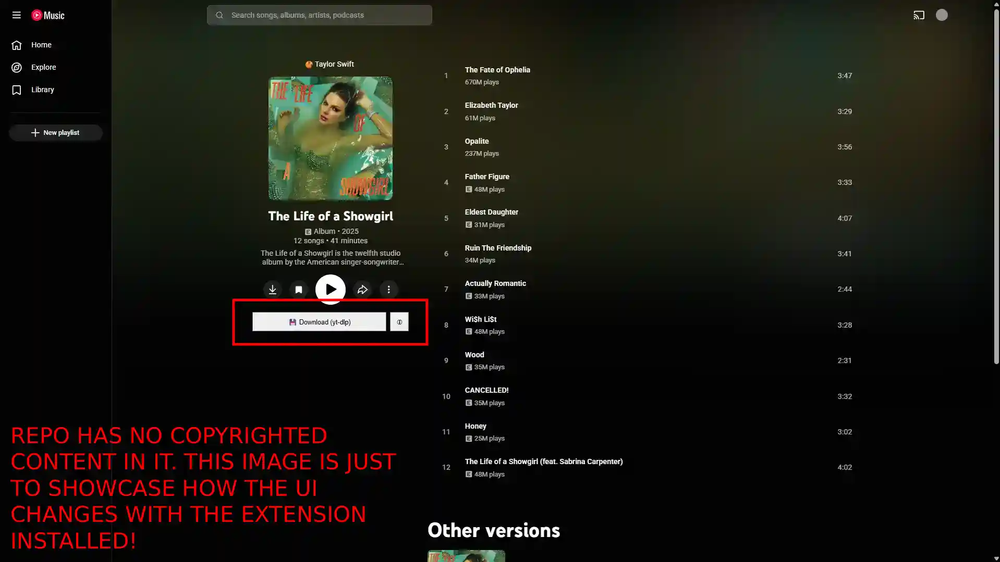

## ui-for-yt-dlp

Yet another yt-dlp tool that will be buried in the endless sea of shit and slop. Built with JavaScript, ran via Node.js.



Makes downloading videos and albums from YouTube and YouTube Music easier when using yt-dlp. Super minimal Chrome extension that pairs with a local server to handle downloads.

## Why?

I have trust issues using repos from random people and most other tools used python. Also had way to much for me to audit.

Why is this any different? 
- This is backed by a real LLC via Articles Media, a company focused on Transparency. 
- Built with no additional libs or packages, just bring your own yt-dlp and Node.js.
- Minimal logic so easy to audit and see what is going on under the hood.

## Warning!

- Only use this tool to download content you own! Even though Google can steal whatever content they want from you to train their AI, you can not steal content from them or others!

- This was tested on 2026-06-17 with yt-dlp 2026.06.09. YouTube breaks UI regularly so may not work if this project has not been updated in a while.

## Getting Started

First, install this software, yt-dlp and Node.js

https://github.com/yt-dlp/yt-dlp  
https://nodejs.org/en/download  

Next go to the config.js file and update the paths with your preferred locations.

DOWNLOAD_PATH= This is where files will download to  
YTDLP_PATH= Path to your yt-dlp.exe  

Then you can run either of the following commands from within the server folder, a server is needed for the extension to interact with your local yt-dlp.

```bash
npm start
```

or

```bash
node index.js
```

Lastly install extension via chrome://extensions/ using Load unpacked and select the extension folder.

Note: If you want to use npm run dev then nodemon must be installed globally.

## Attributions

[ArticlesJoey - Developer](https://github.com/Articles-Joey)